<div align="center">

# ComfyUI HakuImg

_✨图片处理工具_
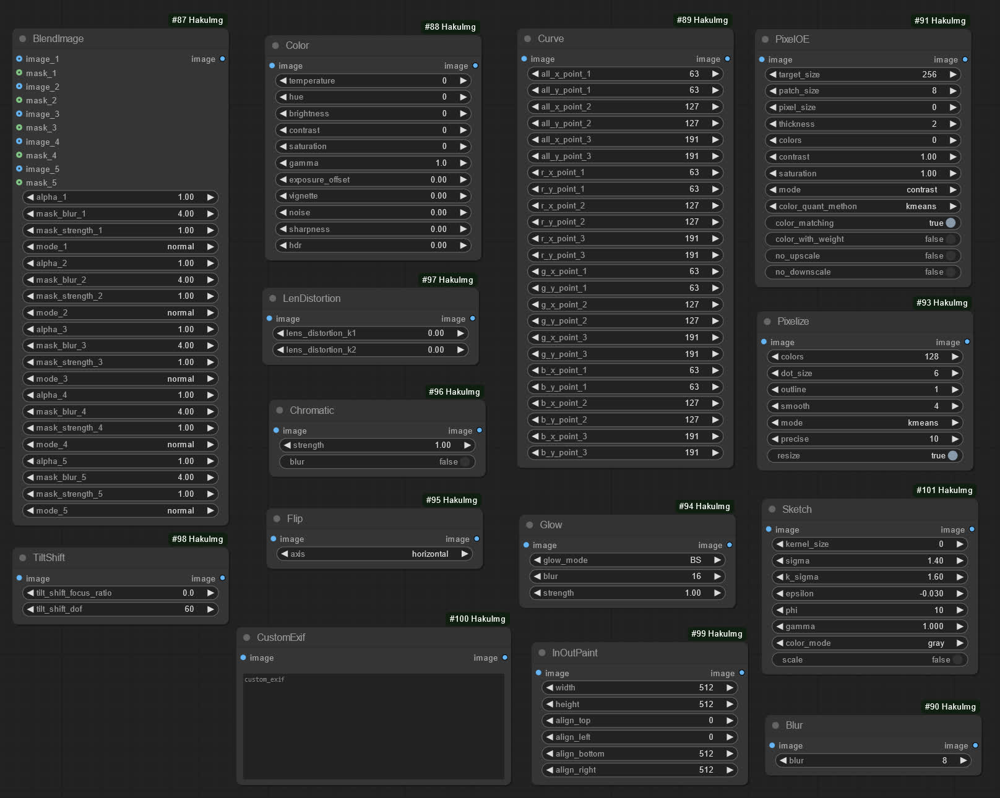
📓 · [Documents](./README.md) · [中文文档](./README-zh.md)
</div>

## 简介
一个在 [ComfyUI](https://github.com/comfyanonymous/ComfyUI) 中处理图片的工具节点，为图片调整效果。

节点移植自 [KohakuBlueleaf/a1111-sd-webui-haku-img](https://github.com/KohakuBlueleaf/a1111-sd-webui-haku-img)。


## 节点
<details>

<summary>BlendImage</summary>

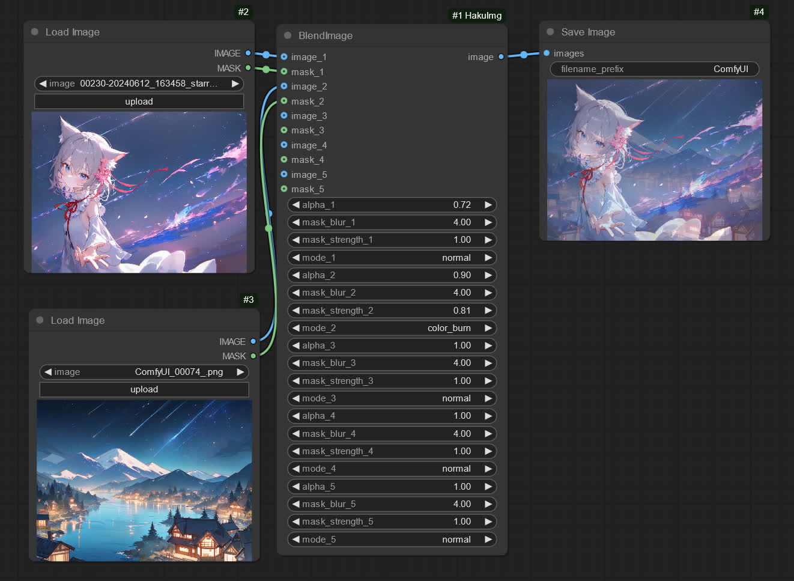

</details>
<details>

<summary>Color</summary>

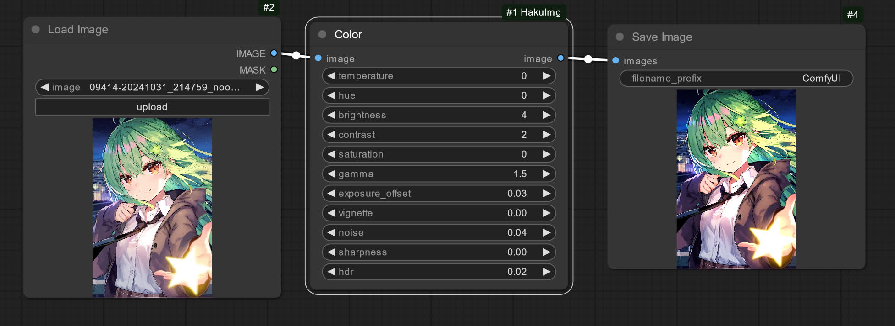

</details>
<details>

<summary>Curve</summary>

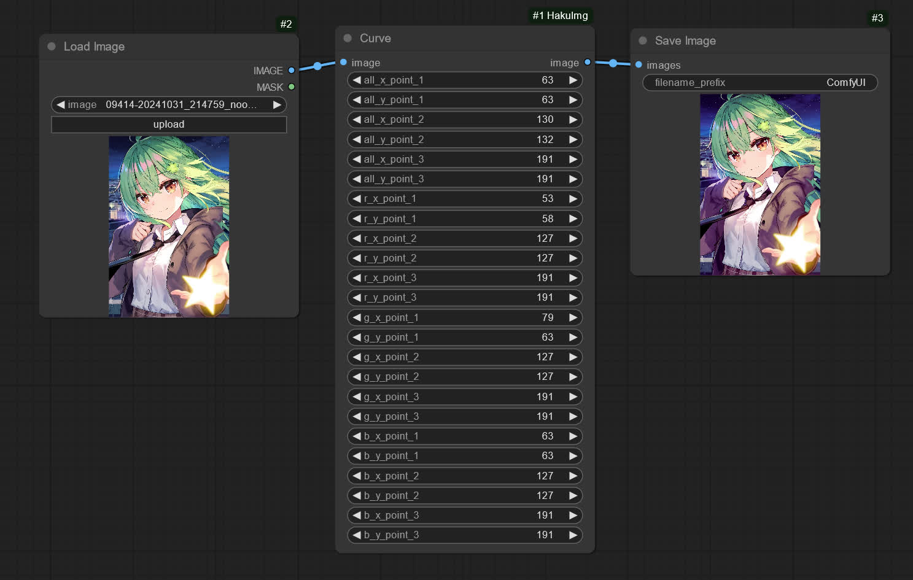

</details>
<details>

<summary>Blur</summary>

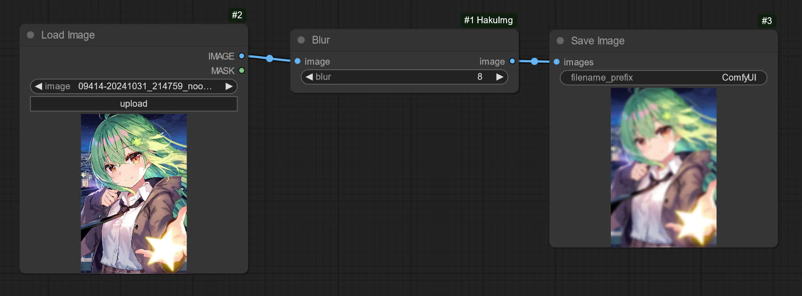

</details>
<details>

<summary>Sketch</summary>

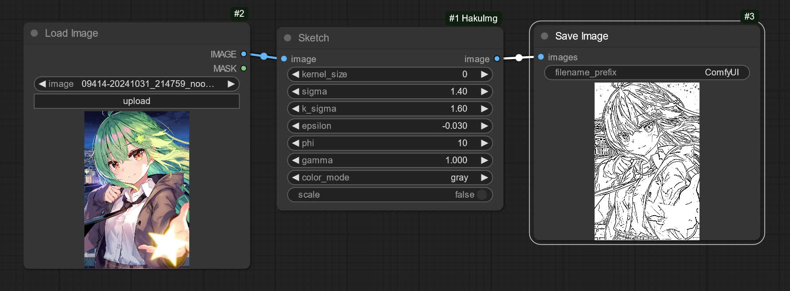

</details>
<details>

<summary>PixelOE</summary>

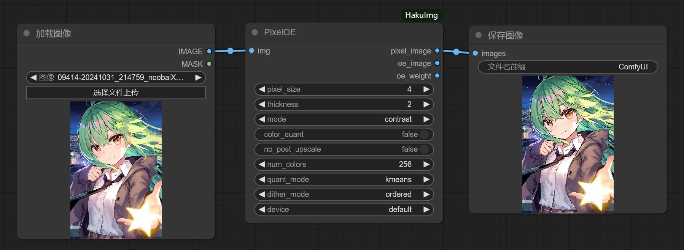

</details>
<details>

<summary>Pixelize</summary>

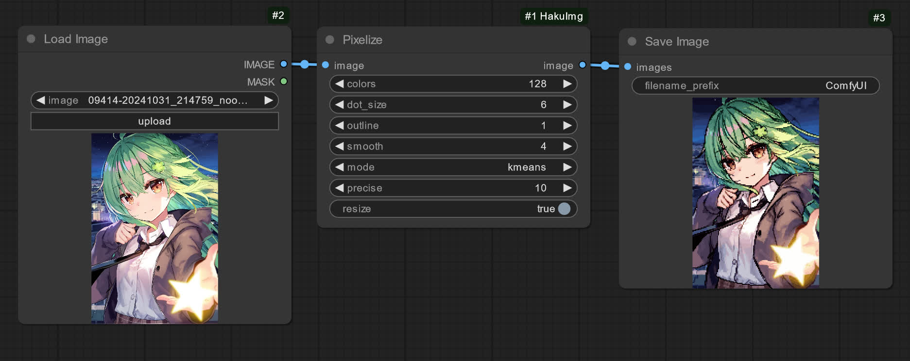

</details>
<details>

<summary>Glow</summary>

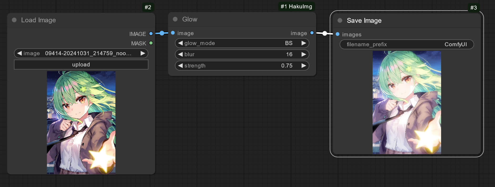

</details>
<details>

<summary>Flip</summary>

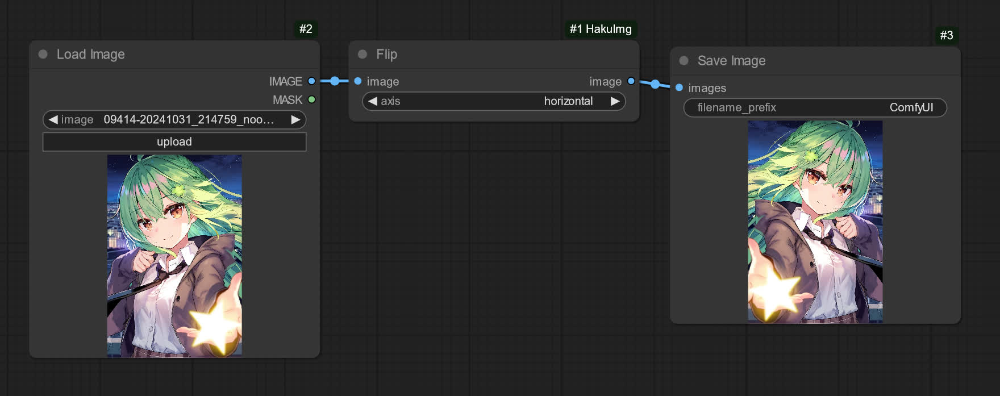

</details>
<details>

<summary>Chromatic</summary>

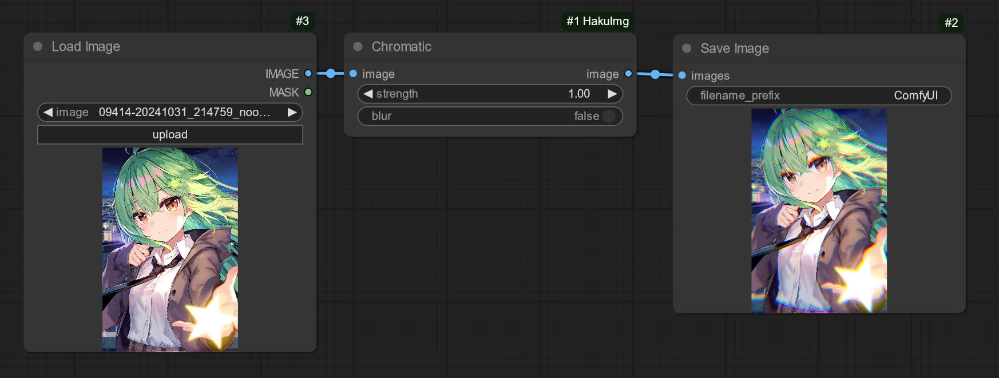

</details>
<details>

<summary>LenDistortion</summary>

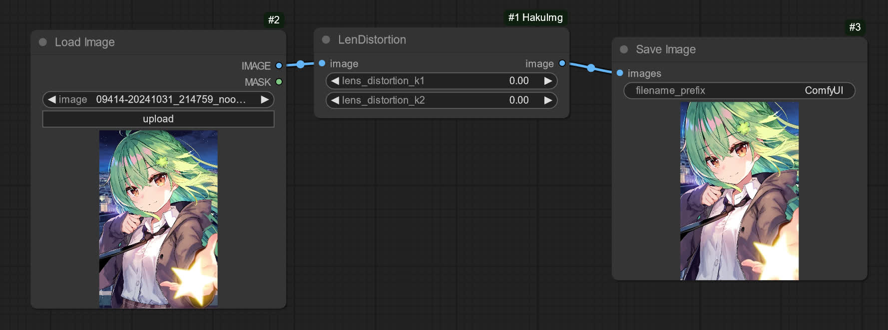

</details>
<details>

<summary>TiltShift</summary>

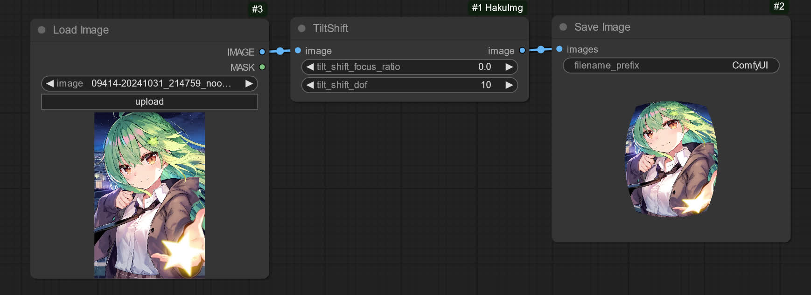

</details>
<details>

<summary>InOutPaint</summary>

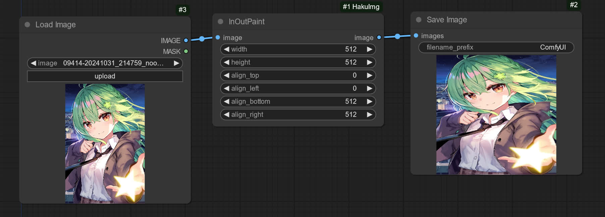

</details>
<details>

<summary>CustomExif</summary>

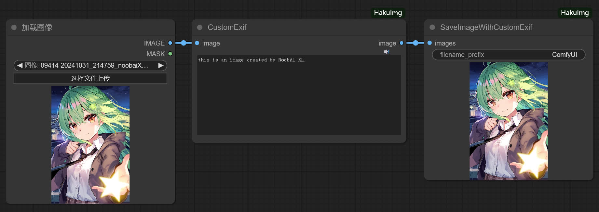

>[!NOTE]  
>建议使用`SaveImageWithCustomExif`节点保存图片。

</details>
<details>

<summary>OutlineExpansion</summary>

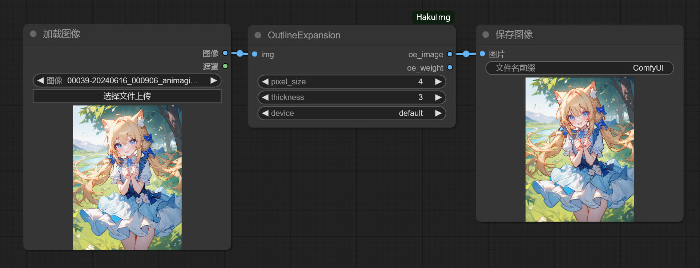

</details>
<details>

<summary>PreResize</summary>

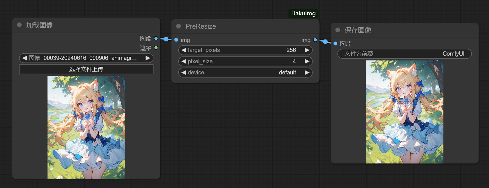

</details>
<details>

<summary>LicykStyle</summary>

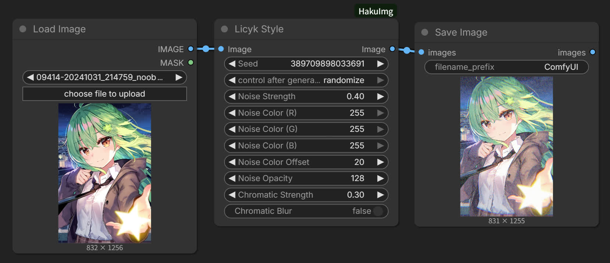

</details>


## 安装
该节点可通过以下几种方式进行安装。

### 使用命令
进入 ComfyUI 的`custom_nodes`文件夹。

```
cd ComfyUI/custom_nodes
```

使用 Git 安装自定义节点。

```
git clone --recurse-submodules https://github.com/licyk/ComfyUI-HakuImg
```


### 使用 ComfyUI Manager
进入 ComfyUI 界面后，打开 ComfyUI Manager，进入**节点管理**，搜索`ComfyUI-HakuImg`并找到`ComfyUI-HakuImg`选项后，点击`Install`进行安装。


### 使用绘世启动器
进入绘世启动器后，点击**版本管理 -> 安装新扩展**，在下方的**扩展 URL**输入框填入该节点的安装地址。

```
https://github.com/licyk/ComfyUI-HakuImg
```

再点击右边的**安装**。


## 使用
节点可在 ComfyUI 节点库中的 **图像 -> HakuImg** 找到。

仓库中的[`example_workflows`](https://github.com/licyk/ComfyUI-HakuImg/tree/main/example_workflows)文件夹有示例工作流，可导入 ComfyUI 中进行使用。


## 鸣谢
- [@KohakuBlueleaf](https://github.com/KohakuBlueleaf) - 提供 HakuImg。
