<div align="center">

# ComfyUI HakuImg

_✨Image Processing Tool_  
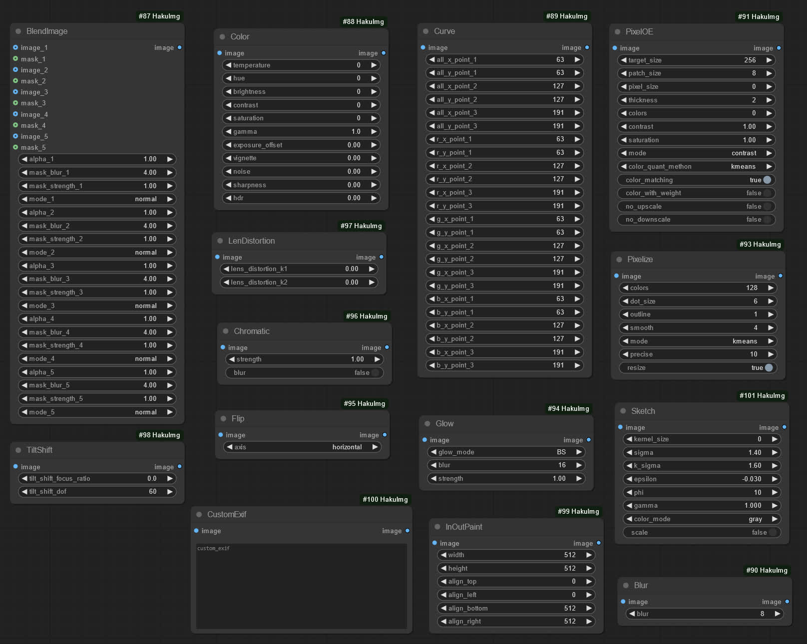  
📓 · [Documents](./README.md) · [中文文档](./README-zh.md)  
</div>

## Introduction
A tool node for processing images in [ComfyUI](https://github.com/comfyanonymous/ComfyUI) that adjusts image effects.

This node is ported from [KohakuBlueleaf/a1111-sd-webui-haku-img](https://github.com/KohakuBlueleaf/a1111-sd-webui-haku-img).


## Nodes
<details>

<summary>BlendImage</summary>

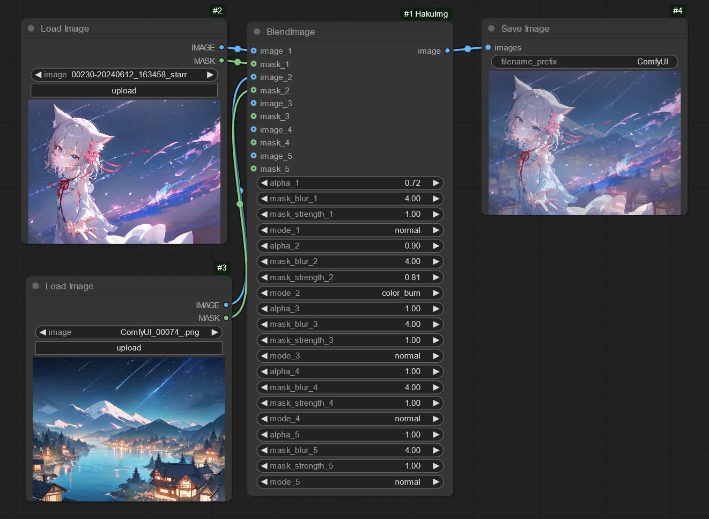

</details>
<details>

<summary>Color</summary>

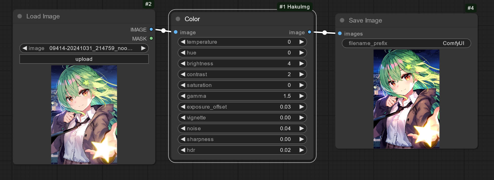

</details>
<details>

<summary>Curve</summary>

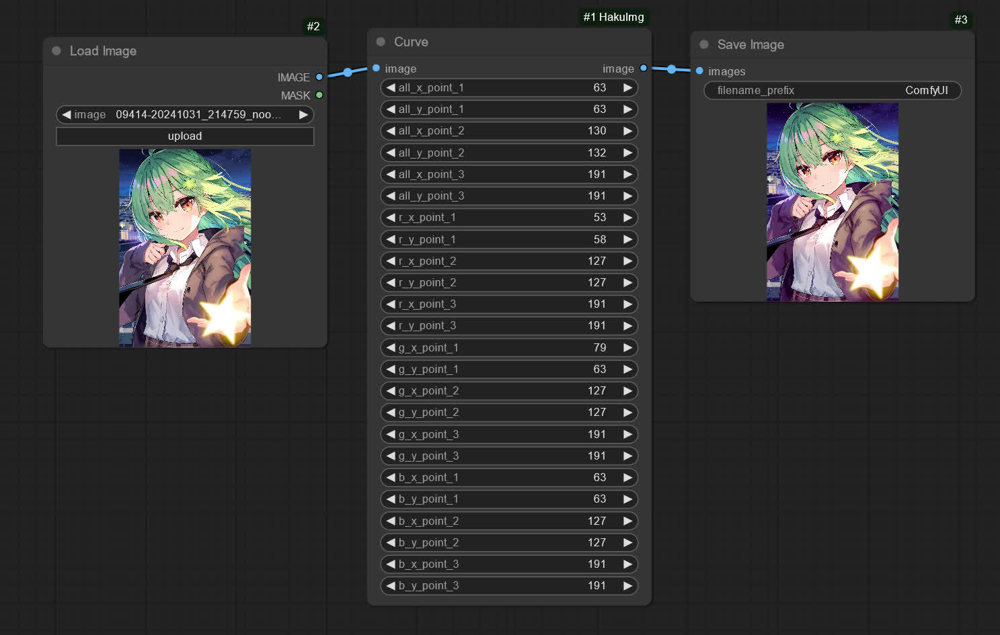

</details>
<details>

<summary>Blur</summary>

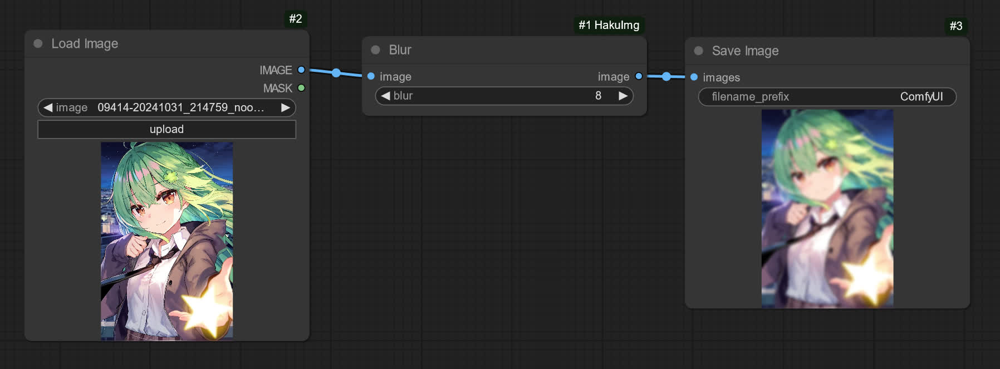

</details>
<details>

<summary>Sketch</summary>

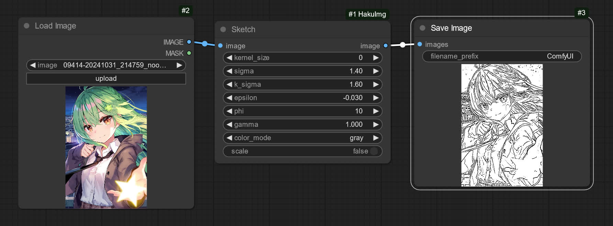

</details>
<details>

<summary>PixelOE</summary>

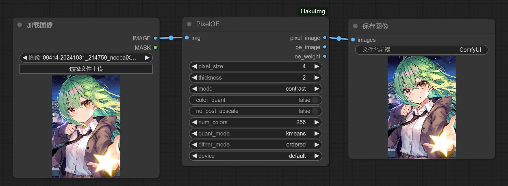

</details>
<details>

<summary>Pixelize</summary>

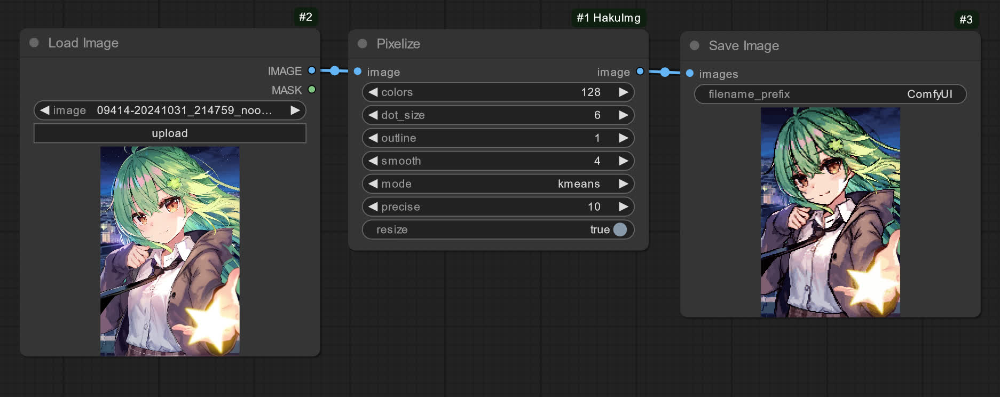

</details>
<details>

<summary>Glow</summary>

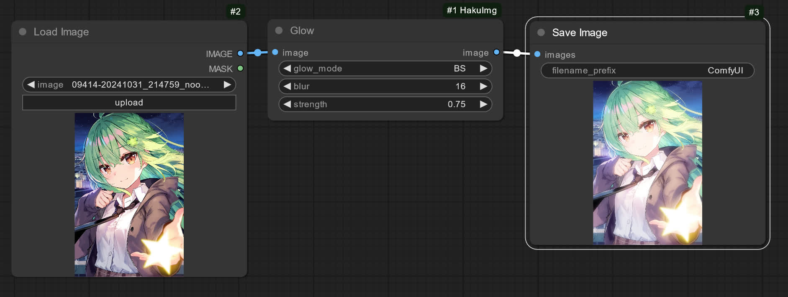

</details>
<details>

<summary>Flip</summary>

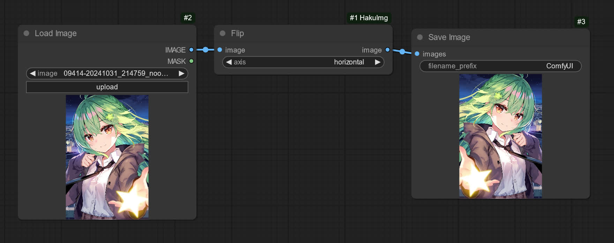

</details>
<details>

<summary>Chromatic</summary>

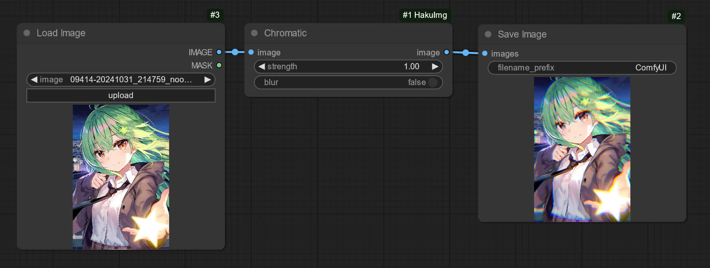

</details>
<details>

<summary>LenDistortion</summary>

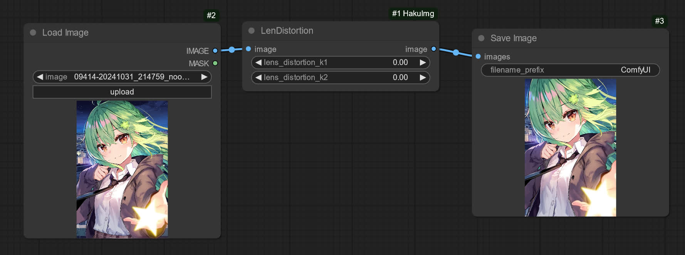

</details>
<details>

<summary>TiltShift</summary>

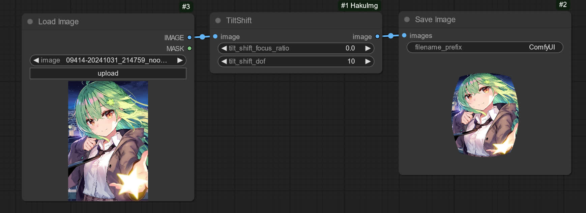

</details>
<details>

<summary>InOutPaint</summary>

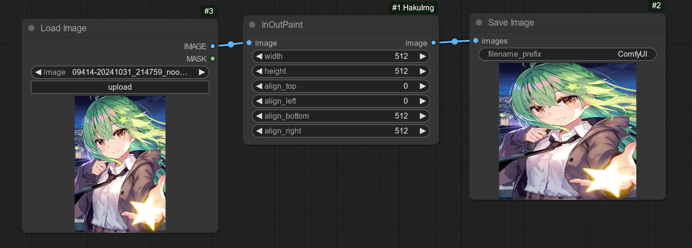

</details>
<details>

<summary>CustomExif</summary>

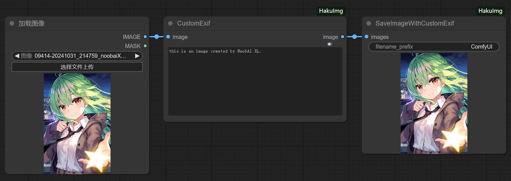

>[!NOTE]  
>It is recommended to use the `SaveImageWithCustomExif` node to save images.

</details>
<details>

<summary>OutlineExpansion</summary>

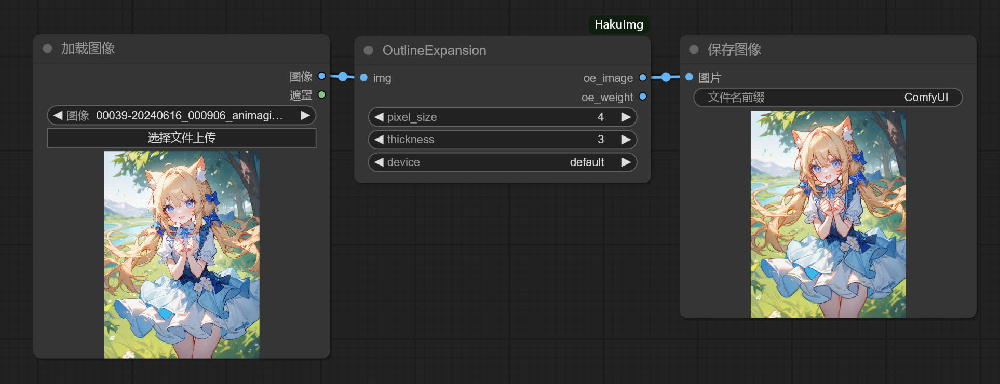

</details>
<details>

<summary>PreResize</summary>

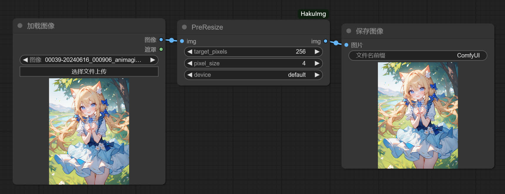

</details>


## Installation
This node can be installed using the following methods.


### Using Command Line
Navigate to the `custom_nodes` folder of ComfyUI.

```
cd ComfyUI/custom_nodes
```

Use Git to install the custom node.

```
git clone --recurse-submodules https://github.com/licyk/ComfyUI-HakuImg
```


### Using ComfyUI Manager
In the ComfyUI interface, open the ComfyUI Manager. Go to **Custom Nodes Manager**, search for `ComfyUI-HakuImg`, and locate the `ComfyUI-HakuImg` option. Click `Install` to complete the installation.


### Using HuiShi Launcher
Open the HuiShi Launcher and go to **Versions -> Install Extension**.  
In the **Extension URL** input box, enter the installation URL for the node:

```
https://github.com/licyk/ComfyUI-HakuImg
```

Then, click **Install** on the right.


## Usage
The node can be found in the **Image -> HakuImg** section of the ComfyUI node library.

Example workflows can be found in the [`example_workflows`](https://github.com/licyk/ComfyUI-HakuImg/tree/main/example_workflows) folder in the repository, which can be imported into ComfyUI for use.


## Acknowledgements
- [@KohakuBlueleaf](https://github.com/KohakuBlueleaf) - Provide HakuImg.
